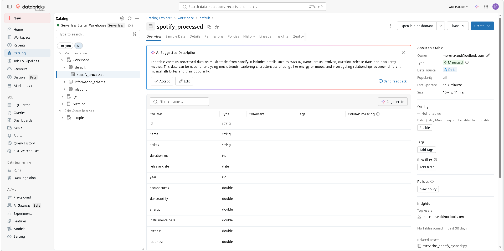
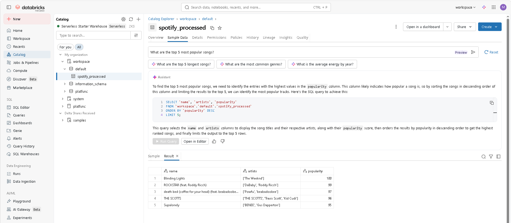
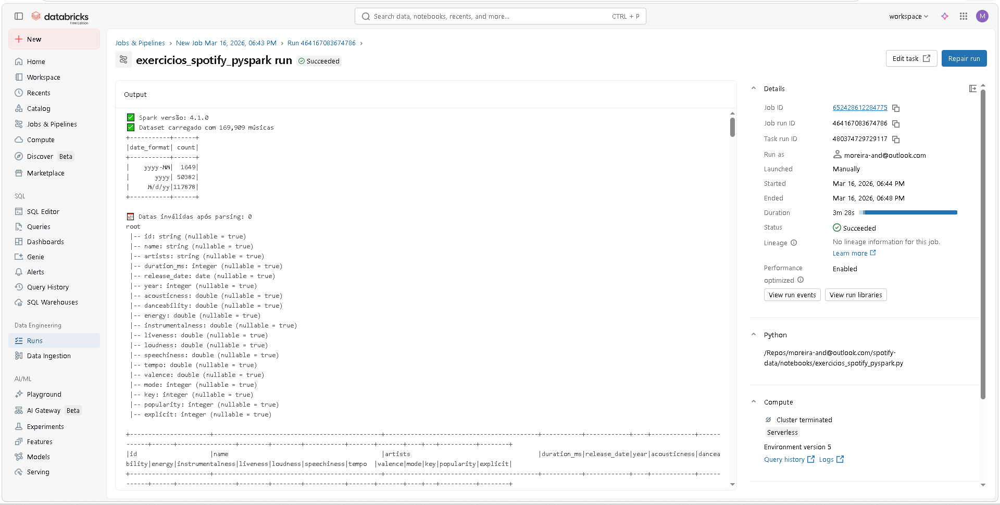

# spotify-data

Este repositório contém uma **análise exploratória baseada em PySpark** de um conjunto de dados do Spotify, concebida como um projeto de portfólio para demonstrar competências em engenharia de dados, análise de dados e usa da plataforma databricks.

## 📌 Estrutura do Projeto

```md
.
├── data/                             # local esperado para o arquivo spotify-data.csv
├── notebooks/
│   └── exercicios_spotify_pyspark.py # script com todo o fluxo de análise
├── evidences/                        # capturas de tela e resultados da execução
└── requirements.txt                  # dependências necessárias para executar a análise

```

## 🚀 Como a análise foi realizada (Databricks)

A análise foi desenvolvida e executada em um workspace Databricks, usando um notebook Python que lê o CSV, transforma os dados e grava os resultados em uma tabela Delta.

### 🔧 Estrutura principal da execução

- O notebook está em `notebooks/exercicios_spotify_pyspark.py` e foi executado como um notebook Databricks (ou importado como script).
- O dataset usado é o `spotify-data.csv`, carregado a partir da pasta `data/`.
- O resultado do processamento é salvo como uma tabela Delta chamada `spotify_processed`.

### 📌 Para reproduzir localmente (opcional)

Caso queira executar localmente fora do Databricks, basta ter o dataset em `data/` e rodar:

```bash
pip install -r requirements.txt
python notebooks/exercicios_spotify_pyspark.py
```

> 💡 No Databricks, as evidências de execução (prints, capturas de tela e resultados) estão disponíveis em `evidences/`, incluindo exemplos de visualização de catálogo, queries e execução de job.
## 🔎 O que está sendo analisado

O script realiza uma sequência de etapas que incluem:

- Carregamento do CSV para um DataFrame Spark
- Exploração inicial (contagens, colunas, estatísticas)
- Filtragem e seleção de registros relevantes
- Criação de colunas derivadas (duração em minutos, década, níveis de energia e humor)
- Agregações por década, artistas e outras dimensões
- Uso de SQL via `createOrReplaceTempView` e `spark.sql`
- Análise avançada com window functions (rankings, médias móveis)
- Criação de UDFs para categorização de gênero
- Exportação de dados processados em uma tabela delta

## 📁 Resultados gerados

Ao executar o script no Databricks, ele gera uma **tabela Delta chamada `spotify_processed`** que pode ser consultada diretamente via SQL ou visualizada no catálogo do workspace.

Além disso, o script imprime métricas, insights e exemplos de consultas no terminal/notebook.

## Release da prova_50

Para a release da `prova_50`, foi seguido o workflow documentado em `docs/workflows/prova_50_workflow.md`:

1. Geracao inicial da solucao com base em politica e especializacao PySpark.
2. Revisao estruturada para identificar erros logicos, inconsistencias e riscos de performance.
3. Refatoracao guiada por plano, com rastreabilidade das mudancas.
4. Debug com feedback real de execucao no Databricks.
5. Ajustes e validacao humana final para garantir aderencia ao enunciado.

Esse processo foi aplicado em camadas de validacao (estrutural, logica, runtime e semantica), reduzindo regressao e aumentando confiabilidade da entrega.

## 🧾 Evidências de execução (Databricks)

A pasta `evidences/` contém capturas de tela do ambiente Databricks usadas para demonstrar o fluxo de trabalho.

- **Visão geral do catálogo (tabela Delta)**

  

- **Exemplo de consulta e preview de dados**

  

- **Execução de job no Databricks**

  

Ao executar o script no Databricks, ele gera uma **tabela Delta chamada `spotify_processed`** que pode ser consultada diretamente via SQL ou visualizada no catálogo do workspace.


Além disso, o script imprime métricas, insights e exemplos de consultas no terminal/notebook.

